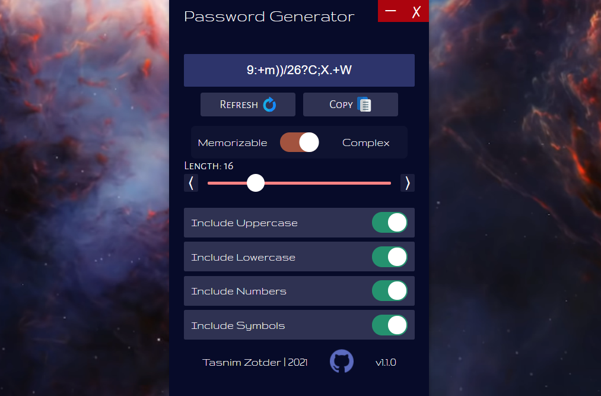

<p align="center">
    
    
    
    
</p>

<p align="center">
    
</p>

# password-generator

Password Generator 🔑

## Framework

- Electron.js

## Wanna Develop ?

### Requirements

- `Node.js` - Download from [https://nodejs.org/](https://nodejs.org/).
- `Electron.js` - Docs on [https://www.electronjs.org/](https://www.electronjs.org/).

### All Clear. Let's Start

1. Clone the repository
```bash
git clone https://github.com/tasnimzotder/password-generator.git
```

2. Go to the project directory
```bash
cd password-generator
```

3. Install the dependencies
```bash
npm install
```

4. Run the app
```bash
npm run start
```

## License

This app is licensed upder the [MIT License](LICENSE)
